# SpaceXef - (SpaceX Efficient Finding)

SpaceXef (SpaceX Efficient Finding) es una solución que consume datos de lanzamientos desde la API de SpaceX, los almacena eficientemente en la nube y los visualiza a través de una aplicación web.

**Aplicación Web:** [http://SpaceXef-Frontend-ALB-498435409.us-east-1.elb.amazonaws.com](http://SpaceXef-Frontend-ALB-498435409.us-east-1.elb.amazonaws.com)  
**Backend API Docs:** [https://epnfnmp8b5.execute-api.us-east-1.amazonaws.com/Prod/docs](https://epnfnmp8b5.execute-api.us-east-1.amazonaws.com/Prod/docs)

** Trigger Ingestión:** [https://epnfnmp8b5.execute-api.us-east-1.amazonaws.com/Prod/ingest](https://epnfnmp8b5.execute-api.us-east-1.amazonaws.com/Prod/ingest)

## Arquitectura 

### 1. Base de Datos (Amazon DynamoDB)
- **Patrón Single-Table Design:** Utiliza una única tabla (`SpaceXef-Data`) para abstraer *Launches*, *Rockets* y *Stats*.
- **Paginación Nativa:** El `SK` (Sort Key) combina un *Unix Time* con el ID para permitir escaneos cronológicos hacia atrás instantáneos de lanzamientos permitien la llamada eficiente de datos.
#### Referencias
- https://docs.aws.amazon.com/amazondynamodb/latest/developerguide/HowItWorks.CoreComponents.html#HowItWorks.CoreComponents.TablesItemsAttributes

- https://docs.aws.amazon.com/amazondynamodb/latest/developerguide/data-modeling-foundations.html

### 2. Lambda de Ingestión en Python (IngestFunction)
-  Configurada con Amazon EventBridge para correr cada 6 horas.
- Recolecta respuestas crudas de SpaceX API v4/v5, extrayendo solo la información necesaria gracias al `POST` endpoint `/query` de la API de SpaceX. Realiza inserciones o actualizaciones (upserts) en DynamoDB, calculando durante el parseo estadísticas de cohetes y lanzamientos, evitando la necesidad de computarlos en el frontend.
- Accesible mediante un `POST` al endpoint `/ingest` para pruebas rápidas.

### 3. API REST FastAPI (AppFunction)
- Contiene permisos de solo lectura sobre la tabla DynamoDB.
- Expone endpoints para obtener lanzamientos, cohetes y estadísticas.
- Usa paginación basada en cursor respondiendo a la forma nativa de DynamoDB para recuperar la información, retorna un `next_token` para acceder a la siguiente página, este representa la llave del último item devuelto.

#### Referencias
- [https://oneuptime.com/blog/post/2026-02-02-dynamodb-pagination/view#:~:text=DynamoDB ( Amazon DynamoDB ) uses a,provides consistent performance regardless of dataset size](https://oneuptime.com/blog/post/2026-02-02-dynamodb-pagination/view#:~:text=DynamoDB%20(%20Amazon%20DynamoDB%20)%20uses%20a,provides%20consistent%20performance%20regardless%20of%20dataset%20size).

### 4. Aplicación Web (Next.js)
Construida con **Next.js**, **TailwindCSS**, **Recharts**: Graficos, **Framer Motion**: Animaciones y **Zod**: Validación y tipado.

#### **Dashboard Principal (`/`)**
Vista central con métricas: (Total de lanzamientos, carga, humanos a bordo), tasa de éxitos, y línea de tiempo horizontal animada y personalizada de los lanzamientos, que carga dinámicamente páginas de lanzamientos conforme avanza.

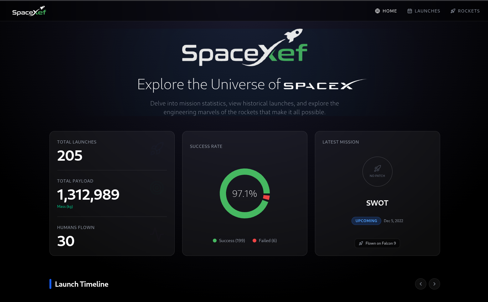
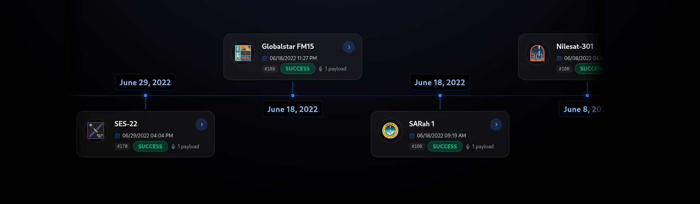

#### **Explorador de Lanzamientos (`/launches`)**
Directorio avanzado con paginación integrada y lista cargada bajo el concepto de scroll infinito para recuperación fluida usando Observers. Posee barras de búsqueda  y filtros dinámicos por estados.

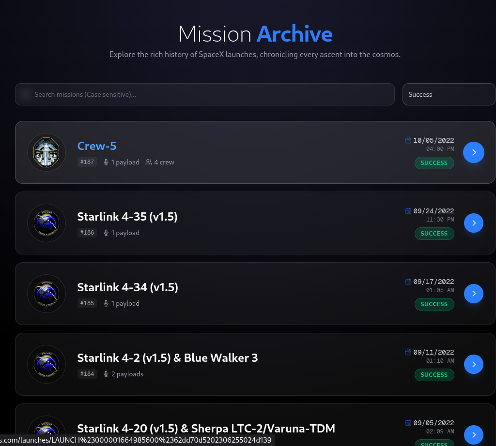

#### **Detalle de lanzamiento (`/launches/[id]`)**
Muestra información detallada de un lanzamiento específico, incluyendo tripulación, carga útil,reportes de fallas, y embed de video.
  
  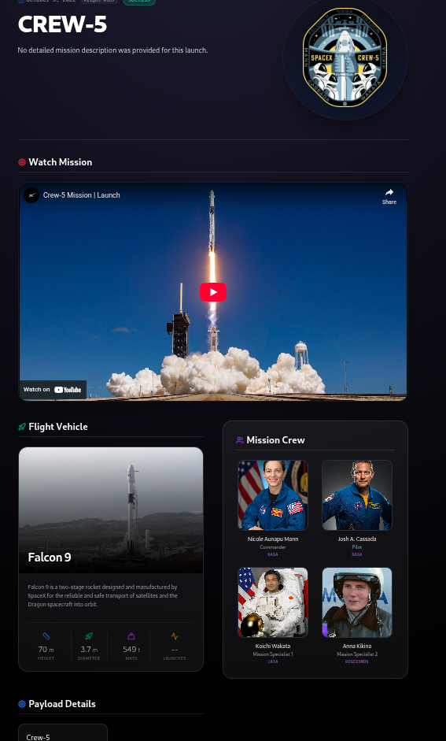
  
#### **Flota de Cohetes (`/rockets`)**

  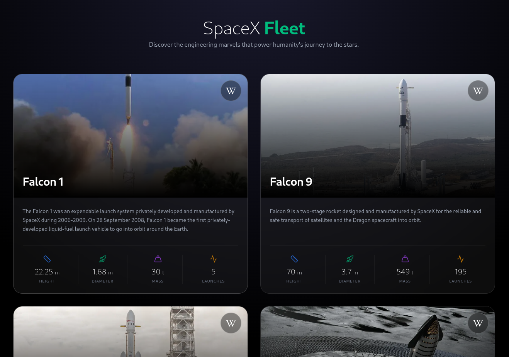


---

### Requisitos Previos Locales
- [AWS CLI](https://aws.amazon.com/cli/) instalado y configurado (`aws configure`).
- [AWS SAM CLI](https://docs.aws.amazon.com/serverless-application-model/latest/developerguide/install-sam-cli.html).
- [Docker](https://www.docker.com/).
- Python 3.13
- Node.js 20


## 💻 Entorno de Desarrollo (Local)

Para probar en local, ejecuta el ecosistema completo internamente simulando la base de datos localmente.

**1. Levantar el Backend Local (BBDD + API):**
```bash
# 1. Iniciar DynamoDB Local en Docker (Nota: Requiere sudo para docker)
sudo docker run -d -p 8000:8000 --name dynamodb-local amazon/dynamodb-local

# 2. Crear la tabla local
AWS_ACCESS_KEY_ID=test AWS_SECRET_ACCESS_KEY=test AWS_DEFAULT_REGION=us-east-1 aws dynamodb create-table \
    --table-name SpaceXef-Data \
    --attribute-definitions AttributeName=PK,AttributeType=S AttributeName=SK,AttributeType=S \
    --key-schema AttributeName=PK,KeyType=HASH AttributeName=SK,KeyType=RANGE \
    --billing-mode PAY_PER_REQUEST \
    --endpoint-url http://localhost:8000

# 3. Poblar la base de datos local (Trigger Ingestión)
pip install -r backend/ingest/requirements-dev.txt
LOCAL_DDB=1 python3 backend/ingest/core_ingestion.py

# 4. Arrancar la API local de FastAPI (Puerto 8001)
pip install -r backend/app/requirements.txt
LOCAL_DDB=1 uvicorn backend.app.main:app --reload --port 8001
```

**2. Levantar el Frontend Local (Next.js):**
En una terminal paralela:
```bash
cd frontend/spacexef
npm install

# Mover la inyección de API hacia la API FastAPI corriendo en el puerto 8001
API_URL=http://localhost:8001 npm run dev
```
*(Aplicación web accesible in [http://localhost:3000](http://localhost:3000))*

---

## 🚀 Entorno de Despliegue (Producción AWS)

### Paso 1: Desplegar el Backend (AWS SAM)
Desde la raíz del repositorio:
```bash
sam build --template-file infra/app.yaml
sam deploy --no-confirm-changeset
```


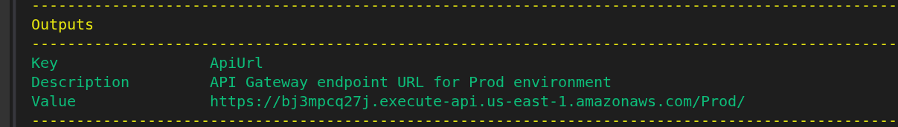

Al ingresar a CloudFormation podremos ver el stack creado

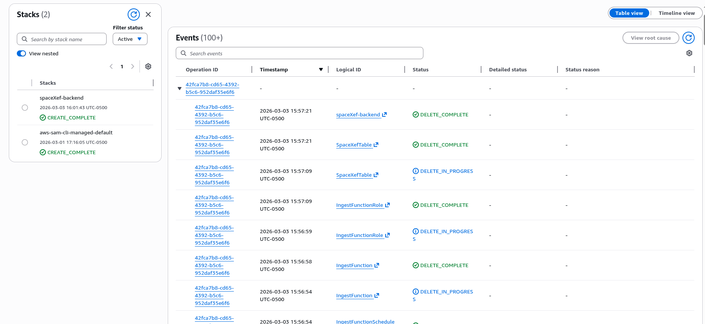


⚠️ **Importante:** Asegúrate de anotar la `ApiUrl` obtenida. Debes realizar una petición `POST` al endpoint `/ingest` (ej. `https://tu-api.execute-api.us-east-1.amazonaws.com/Prod/ingest`) para poblar la base de datos en AWS. ⚠️

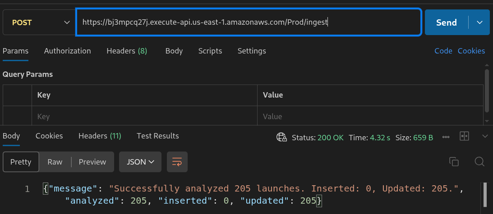

Al entrar a DynamoDB podremos ver la tabla creada

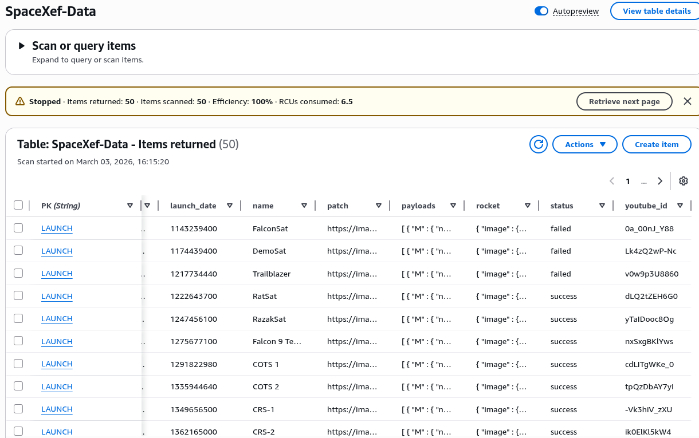


### Paso 2: Crear el Repositorio de Amazon ECR
Antes de subir la imagen Docker, es necesario desplegar el stack de ECR para crear el repositorio (esto se realiza por única vez).
```bash
aws cloudformation deploy \
    --template-file infra/ecr-stack.yaml \
    --stack-name spaceXef-frontend-ecr \
    --no-fail-on-empty-changeset
```

Se verá creado de esta forma

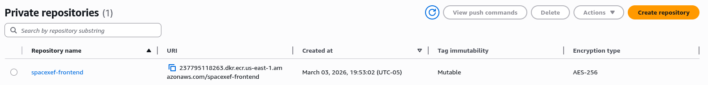


### Paso 3: Construir la Imagen Frontend y Subirla a Amazon ECR
Debes iniciar sesión localmente en ECR, construir la imagen de Docker usando y empujarla al repositorio AWS creado por CloudFormation. Reemplaza:

```bash
# 1. Autenticar Docker con el registro de ECR
aws ecr get-login-password --region <REGION> | sudo docker login --username AWS --password-stdin <TU_ACCOUNT_ID>.dkr.ecr.<REGION>.amazonaws.com

# 2. Construir la imagen de Next.js optimizada
cd frontend/spacexef
docker build -t spacexef-frontend:latest .

# 3. Etiquetar la imagen para el repositorio remoto
docker tag spacexef-frontend:latest <TU_ACCOUNT_ID>.dkr.ecr.<REGION>.amazonaws.com/spacexef-frontend:latest

# 4. Subir la imagen a AWS ECR
docker push <TU_ACCOUNT_ID>.dkr.ecr.<REGION>.amazonaws.com/spacexef-frontend:latest
```
Aparecera la imagen en el registro de ECR
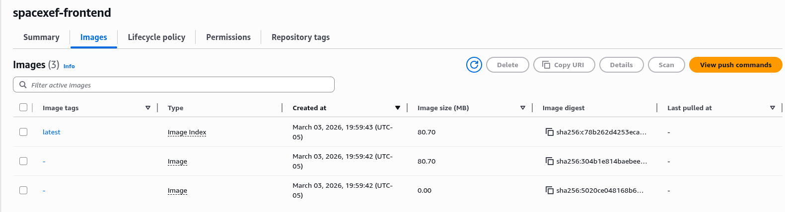


### Paso 4: Desplegar Infraestructura del Frontend (Fargate / ALB)
Antes de ejecutar el despliegue, necesitas tu `VPC ID` y al menos dos `Subnet IDs`.
*(Nota: Las cuentas nuevas de AWS (Free Tier) vienen con una VPC y Subnets por defecto preconfiguradas, por lo que los siguientes comandos te devolverán valores listos para usar).*

Puedes obtenerlos desde la Consola AWS (VPC Dashboard) o usando la AWS CLI:
```bash
# Obtener el ID de la VPC por defecto
aws ec2 describe-vpcs --filters Name=isDefault,Values=true --query 'Vpcs[0].VpcId' --output text

# Obtener las Subnets asociadas a esa VPC
aws ec2 describe-subnets --filters Name=vpc-id,Values=<TU_VPC_ID> --query 'Subnets[0:2].SubnetId' --output text
```

Con esos valores, ejecuta el despliegue:
```bash
# Vuelve a la raíz
cd ../../ 

aws cloudformation deploy \
    --template-file infra/frontend-stack.yaml \
    --stack-name spaceXef-frontend \
    --parameter-overrides \
        ImageTag=latest \
        VpcId=<TU_VPC_ID> \
        SubnetIds=<SUBNET_1>,<SUBNET_2> \
    --capabilities CAPABILITY_NAMED_IAM \
    --no-fail-on-empty-changeset
```

*Para obtener la URL pública (Application Load Balancer) de tu aplicación web recién desplegada, ejecuta:*
```bash
aws cloudformation describe-stacks --stack-name spaceXef-frontend --query 'Stacks[0].Outputs[?OutputKey==`FrontendUrl`].OutputValue' --output text
```

---

## 🔄 Integración y Despliegue Continuo (CI/CD GitHub Actions)

El proyecto contiene dos sólidas *workflows* de **GitHub Actions** (`.github/workflows/`), separando elegantemente la capa backend y frontend para evitar despliegues inactivos.

1. **`backend.yml`**:
   - Se activa cuando hay un `push` a la carpeta `/backend/` o al archivo `infra/app.yaml`.
   - **Flujo**: Configura Python 3.13 → Ejecuta pruebas con `pytest` → En caso de éxito, ejecuta un `sam build` seguido de un `sam deploy` hacia AWS.

2. **`ecr.yml`**:
   - Se activa con cambios en `infra/ecr-stack.yaml` o manualmente (`workflow_dispatch`).
   - Sirve para asegurar que el repositorio de ECR exista de forma independiente.

3. **`frontend.yml`**:
   - Se activa con cambios en `/frontend/spacexef/` o `infra/frontend-stack.yaml`.
   - **Flujo de Pruebas**: Configura Node 20 → Ejecuta Linters → Pasa las pruebas automatizadas de Vitest.
   - **Flujo de Construcción (Solo en `main`)**: Autentica en AWS → Hace el *build* de la imagen de Docker pasándole al servidor standalone sus variables → Hace `push` masivo hacia **Amazon ECR**.
   - **Flujo de Despliegue**: Modifica o crea la infraestructura `CloudFormation` pertinente y forza una rotación escalonada sin tiempo de inactividad (Zero-Downtime) dentro del cluster de **ECS Fargate**.

Ambos pipelines implementan mitigación de errores; el backend específicamente incluye confirmación de despliegue protegido. El backend utiliza el modo de **Rollback Automático** asegurando en todo momento configuraciones estables (`disable_rollback = false` en `samconfig.toml`).

### ¿Cómo habilitar las GitHub Actions?
Para que los pipelines de CI/CD funcionen correctamente al hacer *Push* a tu cuenta de GitHub, debes ir a la configuración de tu repositorio (**Settings > Secrets and variables > Actions**) y configurar lo siguiente:

**1. Variables de Repositorio (Repository Variables):**
- `VPC_ID`: El ID de tu VPC (Ej. `vpc-01234abcd`).
- `SUBNET_IDS`: Una lista separada por comas de al menos dos de tus Subnets (Ej. `subnet-1234,subnet-5678`).

**2. Secretos de Repositorio (Repository Secrets):**
- `AWS_ACCESS_KEY_ID`: Tu access key de IAM.
- `AWS_SECRET_ACCESS_KEY`: Tu secret key de IAM.
